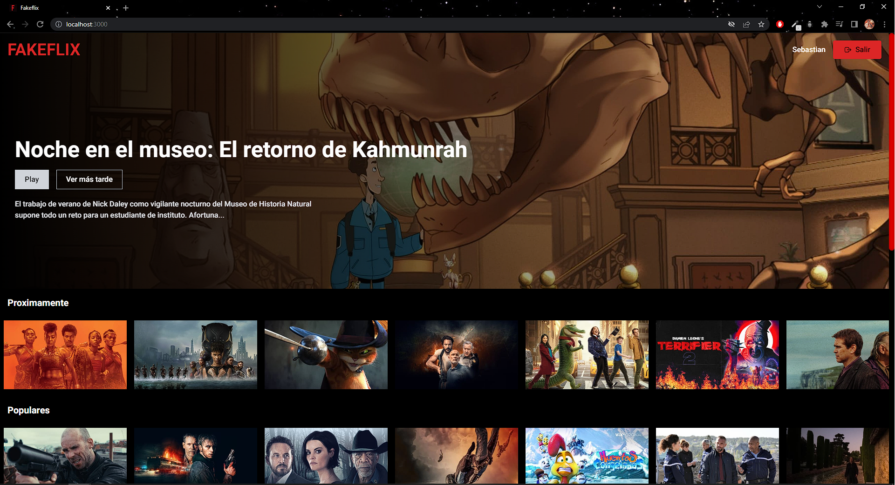

<br/>
<p align="center">
  <a href="https://github.com/Sebmm3010/Fakeflix">
    
  </a>

  <h3 align="center">Fakeflix</h3>

  <p align="center">
    Clon de Netflix con la capacidad de guardar pelicular como favoritas y autenticación con Firebase
    <br/>
    <br/>
    <a href="https://fakeflix-smm.netlify.app/">Demo</a>
    .
  </p>
</p>


## Sobre este proyecto:



Aplicación de películas con diseño tipo Netflix que permite autenticación utilizando Firebase, una base de datos externar propiedad de Google. 
Esta permite:
1. Hacer autenticación por cuenta creada, por Google, o entrar por invitado.
2. Ver pelicular y su descripción gracias a la api de Themoviedb.
3. Guardar las películas en favoritos usando la base de datos de Firebase llamada Firestore.


## Hecho con:

Este proyecto fue construido con:

* [Vitejs](https://vitejs.dev/)
* [React js](https://reactjs.org/)
* [Tailwind Css](https://tailwindcss.com/)
* [Redux-Toolkit](https://redux-toolkit.js.org/)
* [Yarn](https://yarnpkg.com/)

## Empezar:

Descargar desde los archivos desde el repositorio o clonar el repositorio.

```sh
git clone https://github.com/Sebmm3010/Fakeflix.git
```

### Instalaciones

* yarn

```sh
npm install --global yarn
```

### Pre-requisitos

1. Obtener una API Key de  the Movie Database en [https://www.themoviedb.org/]

2. Obtener credenciales de Firebase en [https://firebase.google.com/]

3. Instalar los node_modules con yarn

```sh
yarn install
```

4. Quitar el .template de .env.template y pegar la Api key y las credenciales donde debe ir cada una

```JS
VITE_MOVIEDB=
VITE_APYKEY=
VITE_DOMAIN=
VITE_PROJECTID=
VITE_STORAGE=
VITE_SENDERID=
VITE_APPID=
```
5. Configurar config.js con las credenciales y el getMovies con las .env

## Autor

* **Sebastian Madero** - *Front-end developer | React developer* - [Sebastian Madero](https://github.com/Sebmm3010)
